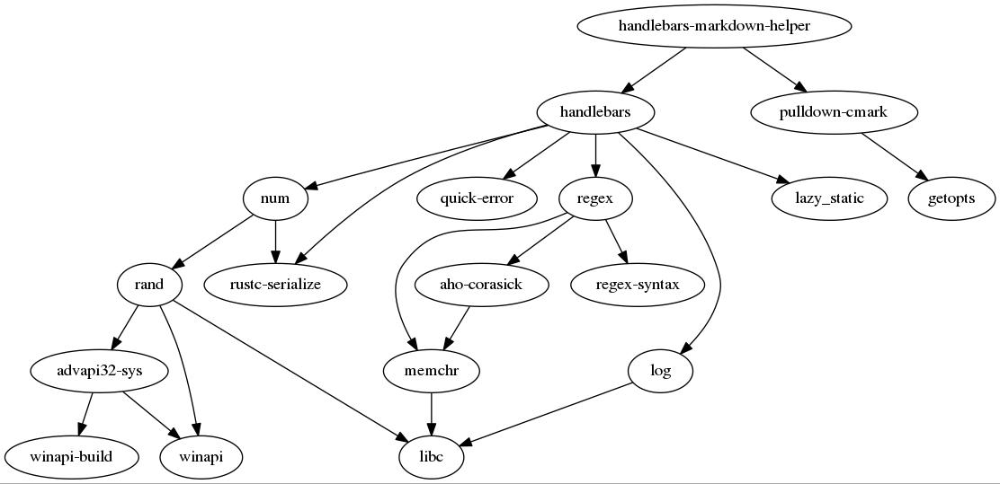

 [](https://crates.io/crates/handlebars-markdown-helper)

# Handlebars Markdown Helper

The [handlebars crate](https://crates.io/crates/handlebars) provides easy templating for any file type. This crate provides a helper for rendering a variable containing markdown into HTML within a temlpate.

## Example

```rust
extern crate handlebars_markdown_helper;
use handlebars_markdown_helper;

let mut handlebars = Handlebars::new();
handlebars.register_helper("markdown", Box::new(handlebars_markdown_helper::markdown_helper));
handlebars.register_template("t0", "{{markdown x}}");

let mut m :BTreeMap<String, String> = BTreeMap::new();
m.insert("x".into(), "# wow\n\n## second wow".into());

let r0 = handlebars.render("t0", &m);
assert_eq!(r0.ok().unwrap(), "<h1>wow</h1>\n<h2>second wow</h2>\n".to_string());
```

---


